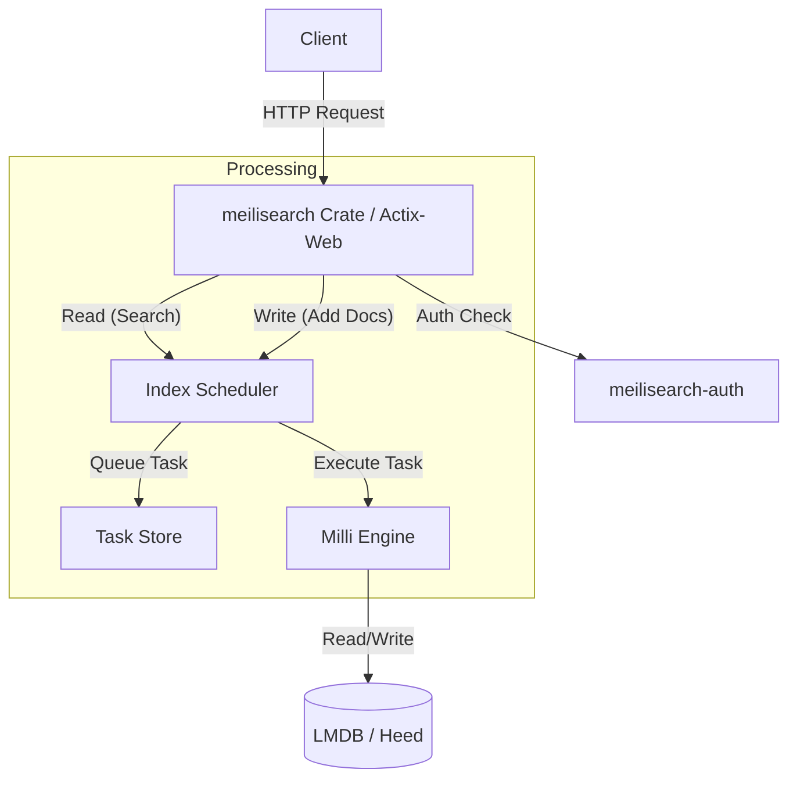

# Meilisearch Codebase Study Plan

This document tracks the plan and progress of understanding the Meilisearch codebase for contribution purposes.

## Plan

1.  [x] **Project Overview**: Understand the high-level purpose, features, and contribution guidelines.
2.  [x] **Architecture & Workspace Structure**: Identify the main crates and their roles within the Cargo workspace.
3.  [x] **Core Components Analysis**:
    *   `meilisearch`: The HTTP server and API layer.
    *   `index-scheduler`: Manages the asynchronous task queue for indexing.
    *   `milli`: The underlying search engine library.
    *   `meilisearch-types`: Shared types and data structures.
4.  [x] **Key Workflows**:
    *   **Search Flow**: Path from HTTP request to search result.
    *   **Indexing Flow**: Path from document upload to searchable index.
5.  [x] **Contribution Preparation**: How to run tests and where to look for issues.

---

## 1. Project Overview

Meilisearch is a RESTful search engine written in Rust. Its main goal is to be fast, easy to use, and to support features like typo tolerance, filtering, and sorting out of the box.

-   **Core Philosophy**: "Search-as-you-type" experience (responds in < 50ms).
-   **Main Engine**: Powered by `milli`, a library designed specifically for Meilisearch.
-   **Tokenization**: Handled by an external library `charabia`.
-   **Storage**: Uses memory-mapped files (via `heed` wrapped around LMDB) for storage.

## 2. Architecture & Workspace Structure

The project is a Rust workspace with multiple crates in the `crates/` directory.

### Key Crates

| Crate | Responsibility |
| :--- | :--- |
| **`meilisearch`** | The binary entry point. It runs the HTTP server (Actix-web), handles configuration, and exposes the REST API. It delegates the actual work to `index-scheduler` and `milli`. |
| **`milli`** | The heart of the engine. It handles the low-level indexing logic (inverted index construction) and search algorithms (ranking rules). It is a library that can be used independently. |
| **`index-scheduler`** | Manages asynchronous tasks (e.g., document additions, settings updates). It ensures tasks are processed in the correct order and handles the task queue (persisted). |
| **`meilisearch-types`** | Contains shared types and traits used across `meilisearch`, `index-scheduler`, and sometimes `milli`. This prevents circular dependencies and unifies type definitions. |
| **`meilisearch-auth`** | Handles API key management and authentication logic. |
| **`file-store`** | Manages the storage of large files (like update payloads) on disk. |

### High-Level Data Flow

## 3. Core Components Analysis

### 3.1. `meilisearch` Crate (The Entry Point)

The `meilisearch` crate acts as the interface between the user (HTTP) and the engine.

-   **Main Entry (`main.rs`)**:
    -   Parses command-line arguments using `clap`.
    -   Sets up logging (`tracing`).
    -   Calls `setup_meilisearch` (in `lib.rs`) to initialize the engine components (`IndexScheduler`, `AuthController`).
    -   Starts the Actix Web server with `create_app`.

-   **HTTP Server (`create_app`)**:
    -   Configures routes (`routes/mod.rs`).
    -   Uses middleware for Metrics, CORS, Compression, and Logging.
    -   Injects `IndexScheduler` into the application state (`Data<IndexScheduler>`).

### 3.2. `index-scheduler` Crate (The Task Manager)

The `index-scheduler` is the "brain" that manages what work needs to be done. It ensures that operations are performed in the correct order and persist across restarts.

-   **Responsibility**:
    -   Manages the global task queue (stored in LMDB).
    -   Executes tasks asynchronously on a dedicated thread.
    -   Controls access to indexes (opening/closing/mapping).
    -   Handles batches of tasks for efficiency.

-   **Key Structures**:
    -   **`IndexScheduler` (`lib.rs`)**: The public handle. It contains the `Env` (LMDB environment) and the `Scheduler` state.
    -   **`Scheduler` (`scheduler/mod.rs`)**: Contains the `tick` loop logic.
    -   **`ProcessingTasks` (`processing.rs`)**: Tracks currently executing tasks.
    -   **`IndexMapper`**: Maps user-facing index names (uids) to internal `milli::Index` instances.

-   **The `tick` Loop**:
    1.  **Cleanup**: Optionally cleans up old tasks.
    2.  **Create Batch**: Groups pending tasks (e.g., multiple document additions) into a `Batch`.
    3.  **Process**: Spawns a thread to run `process_batch`.
    4.  **Commit**: Writes the result (Task Status: Succeeded/Failed) back to the Task DB.

### 3.3. `milli` Crate (The Engine)

`milli` is the library that provides the core indexing and search functionality. It is designed to be embedded and uses LMDB (via `heed`) for storage.

-   **Responsibility**:
    -   **Indexing**: Takes raw JSON documents, processes them (tokenization, flattening, geo-processing), and updates the internal data structures (inverted indexes, KV stores).
    -   **Search**: Parses queries, executes ranking algorithms, and retrieves documents.

-   **Key Structures**:
    -   **`Index` (`index.rs`)**: Represents a Meilisearch index. It holds references to many LMDB databases (e.g., `word_docids`, `documents`, `fields_ids_map`).
    -   **`IndexDocuments` (`update/index_documents/mod.rs`)**: The pipeline for adding/replacing documents.
    -   **`Search` / `SearchContext` (`search/new/mod.rs`)**: The graph-based search implementation.

---

## 4. Key Workflows

### 4.1. Indexing Flow (Document Addition)

When you send a `POST /indexes/movies/documents` request:

1.  **Request Handling (`meilisearch`)**:
    -   The handler receives the payload.
    -   It writes the payload to a file using the `file-store` crate.
    -   It calls `IndexScheduler::register` to enqueue a `DocumentAddition` task.

2.  **Scheduling (`index-scheduler`)**:
    -   The `tick` loop picks up the task.
    -   It calls `create_next_batch` to potentially group multiple document additions.
    -   It spawns a "batch-operation" thread running `process_batch`.

3.  **Processing (`process_batch.rs`)**:
    -   It identifies the task type and calls `milli::IndexDocuments`.

4.  **Indexing Pipeline (`milli::IndexDocuments`)**:
    -   **Extraction**: Reads documents from the file.
    -   **Flattening**: Flattens nested JSON objects.
    -   **Tokenization**: Uses `charabia` to split text into tokens.
    -   **Index Updates**: Updates `documents` DB, `word_docids`, faceted fields, geo index, etc.
    -   **Commit**: The LMDB transaction is committed.

### 4.2. Search Flow

When you send a `POST /indexes/movies/search` request:

1.  **Request Handling (`meilisearch`)**:
    -   The handler parses the search parameters (query, filter, sort, etc.).
    -   It retrieves the `index-scheduler` from app data.
    -   It asks `index-scheduler` for a read-only handle to the index (`index-scheduler::read_txn`).

2.  **Search Execution (`milli`)**:
    -   It calls `milli::search::new::execute_search`.
    -   **Query Parsing**: The query string is tokenized and transformed into a query graph.
    -   **Candidate Retrieval**: A "Universe" of candidate document IDs is computed (filtering applied here).
    -   **Ranking**:
        -   Meilisearch uses a bucket sort approach with a chain of Ranking Rules (Typo, Words, Proximity, Attribute, Exactness, etc.).
        -   It refines the bucket of candidates step-by-step.
    -   **Data Retrieval**: Candidates are hydrated with content from the `documents` DB.

---

## 5. Contribution Preparation

### 5.1. Running Tests

-   **Unit Tests**: Run `cargo test` in the specific crate directory.
    -   Example: `cd crates/milli && cargo test`
-   **Integration Tests**:
    -   Located in `meilisearch/tests`.
    -   Run `cargo test` in the root workspace.

### 5.2. Where to start looking?

-   **Issues**: Look for "good first issue" on GitHub.
-   **New Features**: Usually involve changes in:
    1.  `meilisearch-types` (if API changes).
    2.  `meilisearch` (routes/handlers).
    3.  `milli` (logic implementation).
